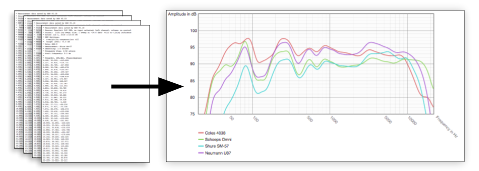

# svg_plotter

> Drawing frequency response bode plots from Room EQ Wizard data in SVG with Python.



This script takes information exported from Room EQ Wizard measurements and draws a graph in an SVG file with a smooth curve for each data set and labels for the frequency and amplitude axes.

## Usage

- Clone repo and install dependencies

- ```bash
  $ git clone https://github.com/jaredellison/svg_plotter
  $ pip install -r requirements.txt
  ```

- Export data from Room EQ Wizard as a text file and copy to project's `data` directory.

  

  ```bash
  $ cp path/to/measurement.txt data/
  ```

- Run script to generate plot

- ```bash
  $ python svg_plotter.py
  ```

- Inspect output plot and adjust ploting parameters in `svg_plotter.py` as desired

- ```bash
  $ open svg_output/data_plot.svg
  ```

##  Inspiration

This project originates from working at the Recorded Music Department at NYU.  Looking for quantitative ways to monitor our microphone collection I initiated a project to regularly test each mic's frequency response using the Room EQ Wizard acoustic test suite. 

The project had an interesting side effect: lots of interesting data that could help students get a better sense of each microphone. Although it's standard for microphones to come with a datasheet showing their frequency response, it's rare to see a comparison of many common microphones on the same scale. 

Room EQ Wizard provides a way to visualize many measurements on a single plot but no way to export a chart of this visualization. I began playing around with ways to generate charts from the measurements to be embedded on the web and accessible to students.

## Highlights

- [`utils/graph.py`](https://github.com/jaredellison/svg_plotter/blob/master/utils/graph.py)

  - This implements the main `Graph` class which builds on top of tools from the `svgwrite` library and provides methods for grouping sets of data and rendering an output file.

    To create a graph, instantiate a new Graph with optional arguments to specify the graph size and plotting range, attach data sets to the instance and call the `.render()` and `.save()` methods to produce an output file.

  - Many of the interesting parts of this class relate to mapping the frequency reponse on a logarithmic scale and relative to the coordinate system of the image.

- [`utils/bspline.py`](https://github.com/jaredellison/svg_plotter/blob/master/utils/bspline.py)

  - In looking for a way to draw a smooth line through each point of measurement data, I was surpised I couldn't find one and decided to implement my own by writing a function that takes a list of points and returns a string representing a path through each point.

- [`utils/color.py`](https://github.com/jaredellison/svg_plotter/blob/master/utils/bspline.py)

  - This project makes it possible to add an arbitrary number of curves to a plot so I implemented a function that generates colors that are consistent in luminosity but are as far apart in hue as possible so it's easier to  tell one from another. This involved thinking about an even distribution of hues in [HSL color space](https://en.wikipedia.org/wiki/HSL_and_HSV) and then translating to [RGB Color space](https://en.wikipedia.org/wiki/RGB_color_space).

    For example, if there are 3 traces the colors will be:

    <div style="width: 2em;
    				    height: 2em;
        				display: inline-block;
        				margin: .5em; 
                background:#cc6565"></div>
    <div style="width: 2em;
    				    height: 2em;
        				display: inline-block;
        				margin: .5em; 
                background:#65cc65"></div>
    <div style="width: 2em;
    				    height: 2em;
        				display: inline-block;
        				margin: .5em; 
                background:#6565cc"></div>

    And if there are 6 traces the colors will be:

    <div style="width: 2em;
    				    height: 2em;
        				display: inline-block;
        				margin: .5em; 
                background:#cc6565"></div>
    <div style="width: 2em;
    				    height: 2em;
        				display: inline-block;
        				margin: .5em; 
                background:#cccc65"></div>
    <div style="width: 2em;
    				    height: 2em;
        				display: inline-block;
        				margin: .5em; 
                background:#65cc65"></div>
    <div style="width: 2em;
    				    height: 2em;
        				display: inline-block;
        				margin: .5em; 
                background:#65cccc"></div>
    <div style="width: 2em;
    				    height: 2em;
        				display: inline-block;
        				margin: .5em; 
                background:#6565cc"></div>
    <div style="width: 2em;
    				    height: 2em;
        				display: inline-block;
        				margin: .5em; 
                background:#cc65cc"></div>

## Dependencies

* [Room EQ Wizard](https://www.roomeqwizard.com) - Free Audio Test software to make measurements and export data to plot
* [svgwrite](https://pypi.org/project/svgwrite/) - SVG Module for Python
* [numpy](http://www.numpy.org/) - Matrix objects are helpful in computing the control points for smoth bspline curves

## Authors

* **Jared Ellison** - [jaredellison.net](http://jaredellison.net)

## Acknowledgments

* **John Mulcahy** - *Excellent free audio test suite* - [Room EQ Wizard](https://www.roomeqwizard.com)
* **Nash Vail** - *Clear explanation of cubic bezier curves* - [Nerding Out with Bezier Curves](https://medium.freecodecamp.org/nerding-out-with-bezier-curves-6e3c0bc48e2f)
* **Kirby A. Baker** - *UCLA Math Dept.* - [Awesome handout on Bsplines](http://www.math.ucla.edu/~baker/149.1.02w/handouts/dd_splines.pdf)
* **David Morrin** - *SVG Drawing Inspiration* - [davidmorrin.com](https://www.davidmorrin.com/)
* **Hendrick Wade Bode** - *Eponymous Plotting Style* - [Hendrick Wade Bode](https://en.wikipedia.org/wiki/Hendrik_Wade_Bode)
